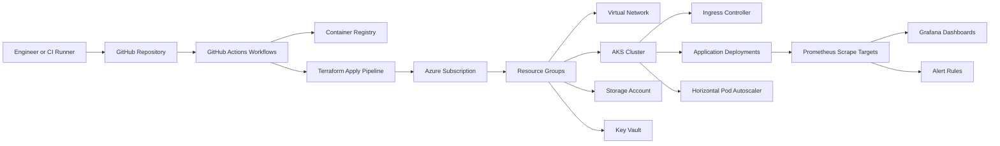

# cloud-infrastructure-blueprints

A collection of cloud infrastructure examples covering Azure, Terraform, Kubernetes, Docker, GitHub Actions, Prometheus, and Grafana.

## Project Overview

This repository groups reusable examples for provisioning infrastructure, deploying workloads, automating delivery, and configuring monitoring.

The repository covers:

- Azure landing zone patterns and service composition
- Terraform module design and environment parameterization
- Kubernetes deployment, ingress, autoscaling, and secret handling
- CI/CD automation with GitHub Actions
- Observability with Prometheus, Grafana, and alerting rules
- Supporting architecture and operational documentation

## Architecture Diagram

## Technologies Used

- Microsoft Azure
- Terraform
- Kubernetes
- Docker
- GitHub Actions
- Prometheus
- Grafana
- YAML, Bicep, and Markdown

## Repository Structure

| Path | Purpose |
| --- | --- |
| `azure/` | Azure-native Bicep examples for core services and reference implementations |
| `terraform/` | Infrastructure as code examples for landing zone, networking, AKS, and monitoring |
| `kubernetes/` | Kubernetes manifests for workloads, ingress, namespaces, configuration, scaling, and security baselines |
| `cicd/` | CI/CD implementation notes and release pipeline design guidance |
| `.github/workflows/` | Executable GitHub Actions workflows for validation, build, image publishing, and deployment |
| `monitoring/` | Prometheus configuration, Grafana dashboard assets, and alert rules |
| `architecture-diagrams/` | Diagram source and architectural narrative for portfolio reviews |
| `docs/` | Supporting documentation, operational notes, and implementation guidance |
| `docker/` | Sample container build context used by the Docker workflow example |

## Cloud Engineering Skills Demonstrated

- Designing Azure landing zones with resource segmentation and tagging
- Building AKS environments with Terraform and managed identities
- Implementing secure networking with VNets, subnets, and NSGs
- Managing Kubernetes workloads using declarative manifests
- Isolating workloads with Kubernetes network policies and disruption budgets
- Automating validation, packaging, and deployment with GitHub Actions
- Shipping monitoring baselines and actionable alert rules
- Structuring infrastructure repositories for maintainability and reuse

## Getting Started

1. Review [the repository guide](docs/repository-guide.md).
2. Start with the Terraform examples in `terraform/`.
3. Review Kubernetes deployment assets in `kubernetes/`.
4. Inspect `.github/workflows/` and `cicd/github-actions/README.md` for CI/CD patterns and required secrets.
5. Apply the Prometheus and alerting assets in `monitoring/`.
6. Import the Grafana dashboard JSON after Prometheus is deployed.

## Notes

- The Terraform examples use placeholder values where subscription-specific IDs are required.
- The Kubernetes manifests use sample namespaces, image names, and TLS secret names that should be customized per environment.
- Configure the required repository secrets before running deployment workflows.
- The AKS deployment workflow expects `AZURE_CLIENT_ID`, `AZURE_TENANT_ID`, `AZURE_SUBSCRIPTION_ID`, `AKS_RESOURCE_GROUP`, `AKS_CLUSTER_NAME`, `PLATFORM_WEB_API_KEY`, and `PLATFORM_WEB_DATABASE_URL` to be configured as GitHub Actions secrets.
